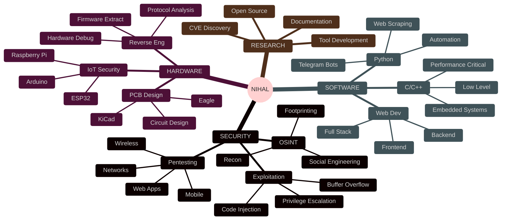

<div align="center">

<!-- Hero Section with Animated Background -->


<!-- Matrix Rain Effect Title -->
<h1>
  
</h1>

<!-- Glowing Badges -->
<p>
  
  
  
</p>

<!-- Social Media with Neon Effect -->
<p>
  <a href="mailto:muhammadnihalmp955@gmail.com">
    
  </a>
  <a href="https://www.linkedin.com/in/muhammed-nihal-mp-96a346283/">
    
  </a>
  <a href="https://t.me/Muhammed_Nihal_MP">
    
  </a>
  <a href="https://github.com/Muhammednihalmp">
    
  </a>
</p>

<!-- Neon Divider -->


</div>

<!-- About Section with Floating Animation -->
<div align="center">

##  TERMINAL ACCESS GRANTED


</div>

```javascript
const EthicalHacker = {
  name: "Muhammed Nihal MP",
  location: "Kerala, India 🇮🇳",
  education: "Diploma in Computer Engineering",
  college: "Ma'din College of Engineering",
  
  expertise: {
    offensive: ["Penetration Testing", "Wireless Hacking", "Social Engineering"],
    hardware: ["ESP32 Development", "PCB Design", "IoT Exploitation"],
    software: ["Python", "C/C++", "JavaScript", "Bash"],
    security: ["Network Security", "Web Security", "Cryptography"]
  },
  
  currentProjects: [
    "🎯 ESP32 Ultimate Pentesting Suite",
    "🤖 Advanced Telegram IoT Bot Framework",
    "📡 Wireless Protocol Exploitation Tool",
    "🔬 Hardware Reverse Engineering Lab"
  ],
  
  motto: () => {
    console.log("💀 Break it. Learn it. Secure it. 💀");
  }
};

// Initialize
EthicalHacker.motto();
```

<div align="center">

<!-- Animated Divider -->


##  ACTIVE OPERATIONS

</div>

<table>
<tr>
<td width="50%">

<div align="center">

### 🛡️ ESP32 HACKING SUITE


</div>

**🎯 MISSION:** Build the ultimate wireless penetration testing device

**⚙️ TECH STACK:**
```
• ESP32-WROOM-32 / ESP32-C3
• Arduino Framework
• C++ / MicroPython
• Wi-Fi 802.11 b/g/n
• Bluetooth 4.2 / BLE 5.0
```

**💥 CAPABILITIES:**
- ⚡ Wi-Fi Deauthentication & Evil Twin
- 🔵 Bluetooth LE Sniffing & Spoofing
- 📡 Packet Injection & Analysis
- 🎮 Remote Control via Telegram Bot
- 📱 NFC/RFID Attack Vector
- 🌐 Web-based Control Panel

</td>
<td width="50%">

<div align="center">

### 🤖 TELEGRAM IOT FRAMEWORK


</div>

**🎯 MISSION:** Create intelligent automation & control system

**⚙️ TECH STACK:**
```
• Python 3.11+
• aiogram / python-telegram-bot
• MQTT / CoAP / HTTP
• Redis / SQLite
• AsyncIO Framework
```

**💥 CAPABILITIES:**
- 🎛️ Multi-Device Management
- 📊 Real-time Monitoring Dashboard
- 🔔 Instant Security Alerts
- 🗂️ Data Analytics & Logging
- 🔐 Encrypted Communication
- 🌍 Geo-location Tracking

</td>
</tr>
</table>

<div align="center">

<!-- Animated Divider -->


##  WEAPON ARSENAL


<br><br>

<!-- Cybersecurity Tools Matrix -->
### 🔥 CYBERSECURITY TOOLKIT

<table>
<tr>
<td width="25%" align="center">

**🔍 RECONNAISSANCE**


`Nmap` `Netdiscover`
`Wireshark` `Masscan`
`theHarvester` `Shodan`
`Amass` `Recon-ng`

</td>
<td width="25%" align="center">

**🌐 WEB HACKING**


`Burp Suite` `OWASP ZAP`
`SQLmap` `Gobuster`
`Nikto` `WPScan`
`Nuclei` `FFUF`

</td>
<td width="25%" align="center">

**🔓 EXPLOITATION**


`Metasploit` `Empire`
`PowerShell` `Mimikatz`
`Evil-WinRM` `Responder`
`Ghidra` `Radare2`

</td>
<td width="25%" align="center">

**📡 WIRELESS**


`Wifite2` `Bettercap`
`Aircrack-ng` `Ettercap`
`Reaver` `Bluez Tools`
`Kismet` `WiFi Pineapple`

</td>
</tr>
</table>

<br>

### 🔧 HARDWARE PLATFORMS


### 💻 OPERATING SYSTEMS


<!-- Animated Divider -->


##  GITHUB ANALYTICS

<!-- Snake Animation -->
<picture>
  <source media="(prefers-color-scheme: dark)" srcset="https://raw.githubusercontent.com/platane/snk/output/github-contribution-grid-snake-dark.svg">
  <source media="(prefers-color-scheme: light)" srcset="https://raw.githubusercontent.com/platane/snk/output/github-contribution-grid-snake.svg">
  
</picture>

<br><br>

<!-- Stats Cards -->


<br>

<!-- Languages & Activity -->


<br>

<!-- Trophy Showcase -->


<!-- Animated Divider -->


##  LEARNING ROADMAP

</div>



<div align="center">

<!-- Progress Bars -->
<table>
<tr>
<td width="33%" align="center">

<h3>🔐 PENETRATION TESTING</h3>

</td>
<td width="33%" align="center">

<h3>🔧 HARDWARE HACKING</h3>

</td>
<td width="33%" align="center">

<h3>🤖 IoT SECURITY</h3>

</td>
</tr>
</table>

<!-- Animated Divider -->


##  MISSION OBJECTIVES

<table>
<tr>
<td>

| 🎯 OBJECTIVE | 📊 STATUS | 🚀 PROGRESS | ⏰ ETA |
|:------------|:---------|:-----------|:-------|
| ESP32 Pentesting Device | 🟢 ACTIVE | ████████░░ 80% | Q4 2024 |
| Telegram IoT Framework | 🟢 ACTIVE | ███████░░░ 70% | Q1 2025 |
| Hardware Exploitation | 🟡 TESTING | ██████░░░░ 60% | Q2 2025 |
| Wireless Protocol Research | 🟡 TESTING | █████░░░░░ 50% | Q2 2025 |
| Open Source Contribution | 🔴 PLANNED | ███░░░░░░░ 30% | Q3 2025 |
| Security Certifications | 🔴 PLANNED | ██░░░░░░░░ 20% | 2025 |

</td>
</tr>
</table>

<!-- Animated Divider -->


##  PHILOSOPHY

<table>
<tr>
<td align="center">

</td>
</tr>
<tr>
<td align="center">

### 💀 "HACK THE PLANET" 💀

```python
def ethical_hacking():
    while True:
        learn()
        exploit()
        report()
        secure()
        repeat()
    
    return "Making the digital world safer, one vulnerability at a time"
```

<h2>🛡️ CORE VALUES 🛡️</h2>

<table>
<tr>
<td width="25%" align="center">
<br>
<b>🧠 KNOWLEDGE</b><br>
Never Stop Learning
</td>
<td width="25%" align="center">
<br>
<b>⚖️ ETHICS</b><br>
Responsible Disclosure
</td>
<td width="25%" align="center">
<br>
<b>💡 INNOVATION</b><br>
Creative Solutions
</td>
<td width="25%" align="center">
<br>
<b>🔒 SECURITY</b><br>
Protection First
</td>
</tr>
</table>

</td>
</tr>
</table>

<!-- Animated Divider -->


##  CONNECT WITH ME


<h3>🤝 OPEN FOR COLLABORATION ON:</h3>

<table>
<tr>
<td width="25%" align="center">
<br>
<b>Cybersecurity<br>Research</b>
</td>
<td width="25%" align="center">
<br>
<b>Hardware<br>Hacking</b>
</td>
<td width="25%" align="center">
<br>
<b>IoT Security<br>Solutions</b>
</td>
<td width="25%" align="center">
<br>
<b>Open Source<br>Projects</b>
</td>
</tr>
</table>

<br>

<!-- Contact Buttons -->
<a href="mailto:muhammadnihalmp955@gmail.com">
  
</a>
<a href="https://www.linkedin.com/in/muhammed-nihal-mp-96a346283/">
  
</a>
<a href="https://t.me/Muhammed_Nihal_MP">
  
</a>
<a href="https://github.com/Muhammednihalmp">
  
</a>

<br><br>

<!-- Profile Views Counter -->


<!-- Animated Divider -->


<!-- Terminal Output -->
<h3>⚡ ROOT ACCESS GRANTED ⚡</h3>

```bash
┌──(nihal㉿kali)-[~]
└─$ whoami
ethical_hacker

┌──(nihal㉿kali)-[~]
└─$ cat motto.txt
"Hack responsibly. Learn constantly. Secure everything."

┌──(nihal㉿kali)-[~]
└─$ ./hack_the_world.sh
[+] Loading exploits...
[+] Initializing tools...
[+] Ready to secure the digital world!
```

<!-- Footer -->


### 💀 MADE WITH 0x00 AND 0x01 BY [MUHAMMED NIHAL MP](https://github.com/Muhammednihalmp) 💀


</div>
