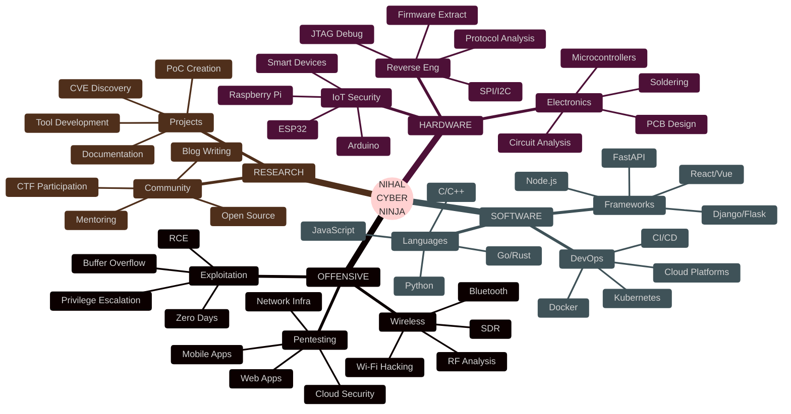

<div align="center">

<!-- Anime Hero Banner -->


<!-- Animated Cyber Text -->
<p align="center">
  
</p>

<!-- Glowing Status Badges -->
<p align="center">
  
  
  
</p>

<!-- Animated Social Links -->
<p align="center">
  <a href="mailto:muhammadnihalmp955@gmail.com">
    
  </a>
  <a href="https://www.linkedin.com/in/muhammed-nihal-mp-96a346283/">
    
  </a>
  <a href="https://t.me/Muhammed_Nihal_MP">
    
  </a>
  <a href="https://github.com/Muhammednihalmp">
    
  </a>
</p>

<!-- Neon Divider -->


</div>

---

<div align="center">

## 『 👨‍💻 SYSTEM.INITIALIZE() 』


</div>

```cpp
#include <iostream>
#include <vector>
#include <map>

class CyberNinja {
private:
    std::string codename = "NIHAL.exe";
    std::string realName = "Muhammed Nihal MP";
    std::string location = "Kerala, India 🇮🇳";
    std::string education = "Diploma in Computer Engineering";
    std::string institution = "Ma'din College of Engineering";

public:
    std::map<std::string, std::vector<std::string>> expertise = {
        {"⚔️ Offensive Security", {
            "Penetration Testing",
            "Wireless Hacking",
            "Web Application Security",
            "Social Engineering",
            "OSINT & Reconnaissance"
        }},
        {"🔧 Hardware Hacking", {
            "ESP32 Development",
            "IoT Exploitation",
            "PCB Design & Fabrication",
            "Firmware Reverse Engineering",
            "Radio Frequency Analysis"
        }},
        {"💻 Software Engineering", {
            "Python • C/C++ • Java",
            "JavaScript • PHP • Bash",
            "Telegram Bot Development",
            "Web Development",
            "Automation Scripts"
        }},
        {"🛡️ Defensive Security", {
            "Network Security",
            "Incident Response",
            "Threat Intelligence",
            "Security Auditing",
            "Digital Forensics"
        }}
    };

    void currentMission() {
        std::cout << "\n🎯 ACTIVE MISSIONS:\n";
        std::cout << "├─ ESP32 Ultimate Pentesting Device\n";
        std::cout << "├─ Advanced Telegram IoT Bot Framework\n";
        std::cout << "├─ Wireless Protocol Exploitation Toolkit\n";
        std::cout << "└─ Hardware Reverse Engineering Laboratory\n";
    }

    std::string getPhilosophy() {
        return "💀 Break systems to understand them.\n"
               "🔧 Understand them to secure them.\n"
               "🛡️ Secure them to protect everyone. 💀";
    }
};

int main() {
    CyberNinja nihal;
    std::cout << "🔥 System Initialized: " << nihal.codename << "\n";
    std::cout << nihal.getPhilosophy() << "\n";
    nihal.currentMission();
    return 0;
}
```

<div align="center">

<!-- Divider -->


</div>

---

<div align="center">

## 『 🚀 ACTIVE.OPERATIONS() 』

</div>

<table>
<tr>
<td width="50%">

<div align="center">

### ⚡ PROJECT ALPHA: ESP32 HACKING SUITE


**『 CODENAME: GHOST PROTOCOL 』**

</div>

<b>🔒 SECURITY</b>
<br>
<sub>Protection First<br>Defend Always</sub>
</td>
</tr>
</table>

<!-- Divider -->


</div>

---

<div align="center">

## 『 🌐 CONNECT.WITH.ME() 』


<br>

### 🤝 Open for Collaboration

<table>
<tr>
<td width="25%" align="center">

<br><br>
<b>🔐 Cybersecurity<br>Research Projects</b>
<br>
<sub>Penetration Testing<br>Security Audits<br>Vulnerability Research</sub>
</td>
<td width="25%" align="center">

<br><br>
<b>🔧 Hardware<br>Hacking Projects</b>
<br>
<sub>IoT Security<br>PCB Design<br>Firmware Development</sub>
</td>
<td width="25%" align="center">

<br><br>
<b>💻 Open Source<br>Development</b>
<br>
<sub>Security Tools<br>Automation Scripts<br>Documentation</sub>
</td>
<td width="25%" align="center">

<br><br>
<b>🎓 Knowledge<br>Sharing</b>
<br>
<sub>Mentoring<br>Blog Writing<br>CTF Teams</sub>
</td>
</tr>
</table>

<br>

### 📱 Social Links

<a href="mailto:muhammadnihalmp955@gmail.com">
  
</a>
<a href="https://www.linkedin.com/in/muhammed-nihal-mp-96a346283/">
  
</a>
<a href="https://t.me/Muhammed_Nihal_MP">
  
</a>
<a href="https://github.com/Muhammednihalmp">
  
</a>

<br><br>

### 📊 Profile Statistics


<!-- Divider -->


</div>

---

<div align="center">

## 『 ⚡ TERMINAL.OUTPUT() 』


</div>

```bash
╔═══════════════════════════════════════════════════════════════╗
║                                                               ║
║   ███╗   ██╗██╗██╗  ██╗ █████╗ ██╗                          ║
║   ████╗  ██║██║██║  ██║██╔══██╗██║                          ║
║   ██╔██╗ ██║██║███████║███████║██║                          ║
║   ██║╚██╗██║██║██╔══██║██╔══██║██║                          ║
║   ██║ ╚████║██║██║  ██║██║  ██║███████╗                     ║
║   ╚═╝  ╚═══╝╚═╝╚═╝  ╚═╝╚═╝  ╚═╝╚══════╝                     ║
║                                                               ║
║   🔥 CYBER NINJA SYSTEM v3.0 🔥                              ║
║                                                               ║
╚═══════════════════════════════════════════════════════════════╝

┌──(nihal㉿kali)-[~]
└─$ whoami
ethical_hacker

┌──(nihal㉿kali)-[~]
└─$ cat /etc/passwd | grep nihal
nihal:x:1000:1000:Muhammed Nihal MP:/home/nihal:/bin/zsh

┌──(nihal㉿kali)-[~]
└─$ sudo ./initiate_hacking.sh

[+] Initializing systems...
[+] Loading exploit database...
[+] Connecting to neural network...
[+] Activating stealth mode...
[✓] All systems operational!

┌──(nihal㉿kali)-[~]
└─$ echo $MOTTO
"Break systems to understand them,
 Understand them to secure them,
 Secure them to protect everyone."

┌──(nihal㉿kali)-[~]
└─$ python3 hack_the_world.py

  ██╗  ██╗ █████╗  ██████╗██╗  ██╗    ████████╗██╗  ██╗███████╗
  ██║  ██║██╔══██╗██╔════╝██║ ██╔╝    ╚══██╔══╝██║  ██║██╔════╝
  ███████║███████║██║     █████╔╝        ██║   ███████║█████╗  
  ██╔══██║██╔══██║██║     ██╔═██╗        ██║   ██╔══██║██╔══╝  
  ██║  ██║██║  ██║╚██████╗██║  ██╗       ██║   ██║  ██║███████╗
  ╚═╝  ╚═╝╚═╝  ╚═╝ ╚═════╝╚═╝  ╚═╝       ╚═╝   ╚═╝  ╚═╝╚══════╝
                                                                 
  ██████╗ ██╗      █████╗ ███╗   ██╗███████╗████████╗           
  ██╔══██╗██║     ██╔══██╗████╗  ██║██╔════╝╚══██╔══╝           
  ██████╔╝██║     ███████║██╔██╗ ██║█████╗     ██║              
  ██╔═══╝ ██║     ██╔══██║██║╚██╗██║██╔══╝     ██║              
  ██║     ███████╗██║  ██║██║ ╚████║███████╗   ██║              
  ╚═╝     ╚══════╝╚═╝  ╚═╝╚═╝  ╚═══╝╚══════╝   ╚═╝              

[*] Target: Digital World
[*] Mission: Make it safer
[*] Status: In Progress...
[✓] Ready to hack responsibly!

┌──(nihal㉿kali)-[~]
└─$ █
```

<div align="center">

<!-- Divider -->


<br>

## 『 💝 SUPPORT.MY.WORK() 』


<br>

**If you find my work helpful, consider:**

⭐ **Starring my repositories**
🔄 **Sharing with the community**
🤝 **Contributing to projects**
💬 **Providing feedback**

<br>

<!-- Divider -->


<br>

## 『 📜 LICENSE 』

```
MIT License

Copyright (c) 2024 Muhammed Nihal MP

Permission is hereby granted, free of charge, to any person obtaining a copy
of this software and associated documentation files (the "Software"), to deal
in the Software without restriction, including without limitation the rights
to use, copy, modify, merge, publish, distribute, sublicense, and/or sell
copies of the Software, and to permit persons to whom the Software is
furnished to do so, subject to the following conditions:

The above copyright notice and this permission notice shall be included in all
copies or substantial portions of the Software.

THE SOFTWARE IS PROVIDED "AS IS", WITHOUT WARRANTY OF ANY KIND, EXPRESS OR
IMPLIED, INCLUDING BUT NOT LIMITED TO THE WARRANTIES OF MERCHANTABILITY,
FITNESS FOR A PARTICULAR PURPOSE AND NONINFRINGEMENT.
```

<!-- Divider -->


<br>

### 🎌 "The quieter you become, the more you can hear" 🎌


<br><br>

---

<div align="center">

**💀 CRAFTED WITH 0x00 AND 0x01 BY [MUHAMMED NIHAL MP](https://github.com/Muhammednihalmp) 💀**

**🔥 HACK RESPONSIBLY • CODE ETHICALLY • SECURE ALWAYS 🔥**

</div>

<br>

<!-- Footer Wave -->


</div>r>

**📡 MISSION BRIEF:**
> Developing the most advanced portable penetration testing device powered by ESP32 microcontrollers for wireless security auditing and IoT exploitation.

<br>

**🛠️ TECHNOLOGY STACK:**
```yaml
Hardware:
  - ESP32-WROOM-32 / ESP32-C3
  - OLED Display (SSD1306)
  - External Antenna Module
  - Li-Po Battery System

Software:
  - C++ / Arduino Framework
  - MicroPython Support
  - Custom Firmware
  
Protocols:
  - Wi-Fi 802.11 b/g/n
  - Bluetooth 4.2 / BLE 5.0
  - NFC / RFID
```

<br>

**⚔️ ATTACK VECTORS:**
- 🌐 **Wi-Fi Operations**
  - Deauthentication Attacks
  - Evil Twin Access Point
  - WPA/WPA2 Handshake Capture
  - Beacon Frame Analysis
  
- 🔵 **Bluetooth Arsenal**
  - BLE Device Enumeration
  - GATT Service Exploitation
  - Bluetooth Spoofing
  - Packet Injection
  
- 📱 **Advanced Features**
  - NFC/RFID Cloning
  - Remote Telegram Control
  - GPS Location Tracking
  - Web-Based Dashboard

</td>
<td width="50%">

<div align="center">

### 🤖 PROJECT BETA: TELEGRAM IOT FRAMEWORK


**『 CODENAME: CYBER NEXUS 』**

</div>

<br>

**🎯 MISSION BRIEF:**
> Creating an intelligent automation framework for remote IoT device management, real-time monitoring, and penetration testing orchestration via Telegram.

<br>

**🛠️ TECHNOLOGY STACK:**
```yaml
Core:
  - Python 3.11+
  - AsyncIO Framework
  - Multi-threading Support

Libraries:
  - aiogram / python-telegram-bot
  - aiohttp / requests
  - paho-mqtt / aiocoap
  
Database:
  - Redis (Caching)
  - SQLite (Storage)
  - InfluxDB (Time-series)
```

<br>

**🎮 CONTROL FEATURES:**
- 🎛️ **Device Management**
  - Multi-device Support
  - Real-time Status Updates
  - Remote Configuration
  - Bulk Operations
  
- 📊 **Monitoring System**
  - Live Dashboard
  - Performance Metrics
  - Alert System
  - Data Analytics
  
- 🔐 **Security Features**
  - End-to-End Encryption
  - User Authentication
  - Role-based Access Control
  - Audit Logging

</td>
</tr>
</table>

<div align="center">

<!-- Divider -->


</div>

---

<div align="center">

## 『 💻 SKILL.TREE() 』

### 🔰 Programming Languages


<br>


<br>

### 🎌 Cybersecurity Arsenal

</div>

<details open>
<summary><b>⚔️ EXPAND FULL ARSENAL</b></summary>

<br>

<table>
<tr>
<td width="33%" valign="top">

**『 🔍 RECONNAISSANCE 』**
```
┌─ Network Scanning
│  ├─ Nmap
│  ├─ Masscan
│  ├─ Netdiscover
│  └─ Wireshark
│
┌─ OSINT Tools
│  ├─ theHarvester
│  ├─ Maltego
│  ├─ Shodan
│  ├─ Recon-ng
│  └─ SpiderFoot
│
└─ Web Reconnaissance
   ├─ Sublist3r
   ├─ Amass
   ├─ Subfinder
   └─ DNSenum
```

</td>
<td width="33%" valign="top">

**『 🌐 WEB EXPLOITATION 』**
```
┌─ Vulnerability Scanners
│  ├─ Burp Suite Professional
│  ├─ OWASP ZAP
│  ├─ Nikto
│  ├─ Nuclei
│  └─ WPScan
│
┌─ SQL Injection
│  ├─ SQLmap
│  ├─ SQL Ninja
│  └─ jSQL Injection
│
└─ Directory Brute Force
   ├─ Gobuster
   ├─ Dirbuster
   ├─ FFUF
   └─ Feroxbuster
```

</td>
<td width="33%" valign="top">

**『 🔓 PASSWORD ATTACKS 』**
```
┌─ Hash Cracking
│  ├─ Hashcat
│  ├─ John the Ripper
│  └─ HashID
│
┌─ Network Attacks
│  ├─ Hydra
│  ├─ Medusa
│  └─ Patator
│
└─ Wordlist Generation
   ├─ Crunch
   ├─ CeWL
   ├─ CUPP
   └─ Mentalist
```

</td>
</tr>
<tr>
<td width="33%" valign="top">

**『 📡 WIRELESS HACKING 』**
```
┌─ Wi-Fi Exploitation
│  ├─ Aircrack-ng Suite
│  ├─ Wifite2
│  ├─ Bettercap
│  ├─ Ettercap
│  └─ Reaver
│
└─ Bluetooth Hacking
   ├─ Bluez Tools
   ├─ Btlejack
   ├─ Ubertooth
   └─ Bluetoothctl
```

</td>
<td width="33%" valign="top">

**『 💥 EXPLOITATION 』**
```
┌─ Frameworks
│  ├─ Metasploit Framework
│  ├─ Empire
│  ├─ Covenant
│  └─ Sliver
│
└─ Post-Exploitation
   ├─ Mimikatz
   ├─ PowerShell Empire
   ├─ Evil-WinRM
   └─ Responder
```

</td>
<td width="33%" valign="top">

**『 🔬 REVERSE ENGINEERING 』**
```
┌─ Disassemblers
│  ├─ Ghidra
│  ├─ IDA Pro
│  ├─ Radare2
│  └─ Binary Ninja
│
└─ Forensics
   ├─ Autopsy
   ├─ Volatility
   ├─ Binwalk
   └─ Foremost
```

</td>
</tr>
</table>

</details>

<div align="center">

<br>

### 🔧 Hardware & IoT Platforms


### 🖥️ Operating Systems


<!-- Divider -->


</div>

---

<div align="center">

## 『 📊 GITHUB.STATS() 』

<!-- Snake Animation -->
<picture>
  <source media="(prefers-color-scheme: dark)" srcset="https://raw.githubusercontent.com/platane/snk/output/github-contribution-grid-snake-dark.svg">
  <source media="(prefers-color-scheme: light)" srcset="https://raw.githubusercontent.com/platane/snk/output/github-contribution-grid-snake.svg">
  
</picture>

<br><br>

<!-- Stats Row 1 -->


<br>

<!-- Stats Row 2 -->


<br>

<!-- Trophy Section -->


<!-- Divider -->


</div>

---

<div align="center">

## 『 🎯 MISSION.STATUS() 』


</div>

<br>

| 🎌 PROJECT | 📊 STATUS | 🔥 PROGRESS | ⏰ ETA | 💎 PRIORITY |
|:-----------|:----------|:------------|:-------|:------------|
| **ESP32 Ultimate Pentesting Device** |  |  | Q4 2024 | ⭐⭐⭐⭐⭐ |
| **Telegram IoT Bot Framework** |  |  | Q1 2025 | ⭐⭐⭐⭐⭐ |
| **Hardware Exploitation Lab** |  |  | Q2 2025 | ⭐⭐⭐⭐ |
| **Wireless Protocol Research** |  |  | Q2 2025 | ⭐⭐⭐⭐ |
| **Open Source Security Tools** |  |  | Q3 2025 | ⭐⭐⭐ |
| **Security Certifications** |  |  | 2025 | ⭐⭐⭐ |

<div align="center">

<!-- Divider -->


</div>

---

<div align="center">

## 『 🧠 LEARNING.PATH() 』


</div>



<div align="center">

<br>

### 🔰 Skill Mastery Levels

<table>
<tr>
<td width="33%" align="center">

<h3>⚔️ PENETRATION TESTING</h3>
 
<br>
<sub>🎯 Advanced Level</sub>
</td>
<td width="33%" align="center">

<h3>🔧 HARDWARE HACKING</h3>
 
<br>
<sub>⚡ Proficient Level</sub>
</td>
<td width="33%" align="center">

<h3>🤖 IoT SECURITY</h3>
 
<br>
<sub>🚀 Advanced Level</sub>
</td>
</tr>
</table>

<!-- Divider -->


</div>

---

<div align="center">

## 『 💀 HACKER.PHILOSOPHY() 』


</div>

<table align="center">
<tr>
<td>

```python
#!/usr/bin/env python3
# -*- coding: utf-8 -*-

class HackerEthics:
    """
    The way of the Cyber Ninja
    """
    
    principles = {
        "knowledge": "Never stop learning and evolving",
        "responsibility": "Use power to protect, not to harm",
        "innovation": "Think outside the box, break boundaries",
        "transparency": "Share knowledge, help the community",
        "integrity": "Hack ethically, report responsibly"
    }
    
    @staticmethod
    def manifest():
        return """
        ╔════════════════════════════════════════╗
        ║                                        ║
        ║   💀 THE HACKER'S MANIFESTO 💀         ║
        ║                                        ║
        ║   "We exist without skin color,        ║
        ║    without nationality,                ║
        ║    without religious bias...           ║
        ║                                        ║
        ║    We make use of a service            ║
        ║    already existing without paying     ║
        ║    for what could be dirt-cheap        ║
        ║    if it wasn't run by               ║
        ║    profiteering gluttons...            ║
        ║                                        ║
        ║    I am a hacker, and this is          ║
        ║    my manifesto.                       ║
        ║                                        ║
        ║    You may stop this individual,       ║
        ║    but you can't stop us all..."       ║
        ║                                        ║
        ╚════════════════════════════════════════╝
        """
    
    @staticmethod
    def daily_routine():
        while True:
            learn()      # 🧠 Expand knowledge
            exploit()    # 🔍 Find vulnerabilities
            report()     # 📝 Responsible disclosure
            secure()     # 🛡️ Make systems safer
            innovate()   # 💡 Create new tools
            sleep(4)     # 😴 Rest (occasionally)

if __name__ == "__main__":
    ethics = HackerEthics()
    print(ethics.manifest())
    ethics.daily_routine()
```

</td>
</tr>
</table>

<div align="center">

<br>

### 🎌 Core Values

<table>
<tr>
<td width="20%" align="center">

<br><br>
<b>🧠 KNOWLEDGE</b>
<br>
<sub>Continuous Learning<br>Stay Curious</sub>
</td>
<td width="20%" align="center">

<br><br>
<b>⚖️ ETHICS</b>
<br>
<sub>Responsible Hacking<br>Legal Boundaries</sub>
</td>
<td width="20%" align="center">

<br><br>
<b>💡 INNOVATION</b>
<br>
<sub>Creative Solutions<br>Push Limits</sub>
</td>
<td width="20%" align="center">

<br><br>
<b>🤝 COMMUNITY</b>
<br>
<sub>Share Knowledge<br>Help Others</sub>
</td>
<td width="20%" align="center">

<br><br>
