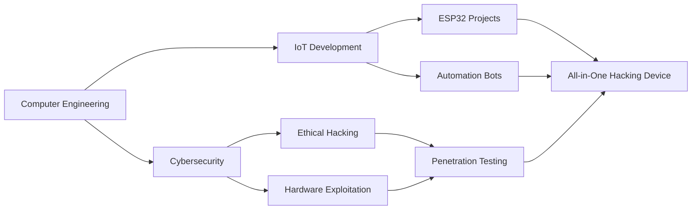

<div align="center">

# 🛡️ Muhammed Nihal MP

### 💻 Computer Engineer | 🔐 Ethical Hacker | 🔧 Hardware Innovator


[](mailto:muhammadnihalmp955@gmail.com)
[](https://www.linkedin.com/in/muhammed-nihal-mp-96a346283/)
[](https://t.me/Muhammed_Nihal_MP)


</div>

## 🎯 About Me

```python
class EthicalHacker:
    def __init__(self):
        self.name = "Muhammed Nihal MP"
        self.role = "Computer Engineer & Security Researcher"
        self.education = "Diploma in Computer Engineering"
        self.institution = "Ma'din College of Engineering, Kerala, India"
        self.location = "Kerala, India 🇮🇳"
        
    def current_focus(self):
        return [
            "ESP32-based Penetration Testing Devices",
            "Telegram Bot Automation for IoT",
            "Wi-Fi & Bluetooth Exploitation Tools",
            "Hardware Hacking & Reverse Engineering"
        ]
    
    def life_motto(self):
        return "Understanding systems deeply to make them better"
```


## 🚀 Current Projects

<table>
<tr>
<td width="50%">

### 🔧 ESP32 Hacking Suite
Building advanced ESP32-based pentesting gadgets for wireless security auditing and IoT exploitation.

**Tech Stack:** `ESP32` `C++` `Arduino` `Wi-Fi` `BLE`

</td>
<td width="50%">

### 🤖 Telegram IoT Bots
Developing intelligent automation bots for remote IoT control and penetration testing workflows.

**Tech Stack:** `Python` `Telegram API` `IoT Protocols`

</td>
</tr>
</table>


## 💻 Tech Arsenal

### Programming Languages
<p align="center">
  
</p>

### Cybersecurity & Penetration Testing
<details>
<summary><b>🔐 Click to view complete toolkit</b></summary>
<br>

| Category | Tools |
|----------|-------|
| **Network Scanning** | Nmap, Netdiscover, Wireshark, Tcpdump |
| **Web Application** | Burp Suite, OWASP ZAP, SQLmap, Gobuster, WPScan |
| **Password Cracking** | John the Ripper, Hashcat, Hydra |
| **Wireless Security** | Wifite, Bettercap, Ettercap |
| **Forensics** | Autopsy, Wireshark |
| **OSINT** | theHarvester, Maltego |
| **Reverse Engineering** | Ghidra |
| **Exploitation** | PowerShell, Evil-WinRM |

</details>

### Hardware & IoT
<p align="center">
  
  
  
  
</p>

### Operating Systems
<p align="center">
  
  
  
  
</p>


## 📊 GitHub Analytics

<div align="center">
  
  
</div>

<div align="center">
  
</div>

<div align="center">
  
</div>


## 🎓 Learning Journey



### 🌱 Currently Mastering
- 🔐 Advanced Penetration Testing Techniques
- 🔧 Hardware Reverse Engineering & Exploitation
- 🤖 Robotics & Automation Systems
- 📡 Wireless Communication Protocols
- 🛡️ Network Security Architecture


## 🏆 Achievements & Goals

<div align="center">

| 🎯 Goal | 📈 Status |
|---------|-----------|
| Build All-in-One Pentesting Device | 🔄 In Progress |
| Master Hardware Exploitation | 🔄 In Progress |
| Contribute to Security Tools | 📝 Planning |
| Develop IoT Security Framework | 📝 Planning |

</div>


## 💡 Philosophy

<div align="center">

> *"Hacking is not about breaking rules—it's about understanding systems deeply and making them better, more secure, and more innovative."*

### 🛡️ Ethical Hacking Principles
**Knowledge • Responsibility • Innovation • Security**

</div>


## 📫 Let's Connect

<div align="center">

### 🤝 Open for Collaboration

I'm always interested in working on:
- 🔐 Cybersecurity Research Projects
- 🔧 Hardware Hacking Innovations
- 🤖 IoT Security Solutions
- 💻 Open Source Security Tools

**Feel free to reach out for collaborations, discussions, or just to connect!**

<br>


</div>


<div align="center">
  
### ⭐ From [Muhammednihalmp](https://github.com/Muhammednihalmp) | Made with 💙 and ☕

</div>
