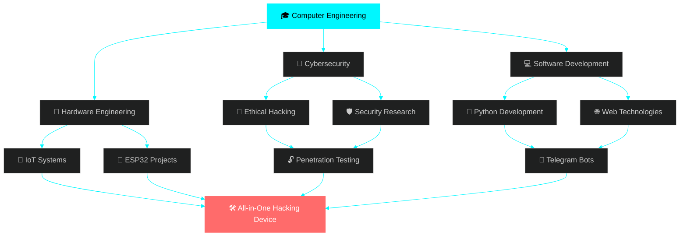

<div align="center">

<!-- Animated Title with Glitch Effect -->


<!-- Animated Typing Effect -->


<!-- Animated Badges -->
<p align="center">
  
  
  
</p>

<!-- Social Links with Hover Animation -->
[](mailto:muhammadnihalmp955@gmail.com)
[](https://www.linkedin.com/in/muhammed-nihal-mp-96a346283/)
[](https://t.me/Muhammed_Nihal_MP)
[](https://github.com/Muhammednihalmp)


</div>

<div align="center">

## 🎯 『 ABOUT ME 』


</div>

```python
#!/usr/bin/env python3
# -*- coding: utf-8 -*-

class EthicalHacker:
    """
    🔐 Security Researcher & Hardware Hacker
    🎓 Diploma in Computer Engineering
    🏫 Ma'din College of Engineering
    """
    
    def __init__(self):
        self.name = "Muhammed Nihal MP"
        self.role = "Computer Engineer & Security Specialist"
        self.location = "Kerala, India 🇮🇳"
        self.mindset = "Offensive Security | Hardware Exploitation"
        
    def expertise(self):
        return {
            "🔐 Security": ["Penetration Testing", "Wireless Hacking", "OSINT"],
            "🔧 Hardware": ["ESP32 Development", "IoT Security", "PCB Design"],
            "💻 Software": ["Python Automation", "Telegram Bots", "Web Apps"],
            "🛡️ Defense": ["Network Security", "Threat Analysis", "Forensics"]
        }
    
    def current_mission(self):
        return [
            "🎯 Building Ultimate ESP32 Pentesting Device",
            "🤖 Developing Advanced Telegram IoT Bots",
            "📡 Researching Wireless Protocol Exploitation",
            "🔬 Reverse Engineering Hardware Components"
        ]
    
    def life_philosophy(self):
        return "💭 'Break it to understand it, understand it to secure it'"

# Initialize hacker
nihal = EthicalHacker()
print(f"👋 Hello World! I'm {nihal.name}")
print(f"🎯 Mission: {nihal.mindset}")
```

<div align="center">

</div>

<div align="center">

## 🚀 『 CURRENT PROJECTS 』

<table>
<tr>
<td width="50%" valign="top">

### 🛠️ ESP32 Hacking Arsenal


Building sophisticated penetration testing gadgets powered by ESP32 for wireless security auditing, BLE exploitation, and IoT vulnerability assessment.

**🔧 Stack:**
- `ESP32-WROOM-32` `ESP32-C3`
- `Arduino IDE` `PlatformIO`
- `C++` `MicroPython`
- `Wi-Fi 802.11` `Bluetooth LE`

**✨ Features:**
- 📡 Wi-Fi Deauth & Evil Twin
- 🔵 BLE Sniffing & Injection
- 📱 NFC/RFID Cloning
- 🎮 Remote Control via Telegram

</td>
<td width="50%" valign="top">

### 🤖 Telegram IoT Automation


Creating intelligent automation bots for remote IoT device control, penetration testing orchestration, and real-time security monitoring.

**🔧 Stack:**
- `Python 3.11+` `aiogram`
- `python-telegram-bot`
- `MQTT` `CoAP` `HTTP`
- `SQLite` `Redis`

**✨ Features:**
- 🎛️ Remote Device Management
- 📊 Real-time Monitoring
- 🔔 Security Alerts
- 🗂️ Data Logging & Analytics

</td>
</tr>
</table>


</div>

<div align="center">

## 💻 『 TECH ARSENAL 』

### 🔤 Programming Languages


<br><br>

### 🔐 Cybersecurity Toolkit

<details open>
<summary><b>🎯 Click to Expand Full Arsenal</b></summary>
<br>

<table>
<tr>
<td width="33%" valign="top">

**🔍 Reconnaissance**
- 🌐 Nmap
- 📡 Netdiscover
- 🦈 Wireshark
- 🔎 theHarvester
- 🕸️ Maltego
- 📊 Shodan
- 🗺️ Amass

</td>
<td width="33%" valign="top">

**🌐 Web Application**
- 🐝 Burp Suite Pro
- ⚡ OWASP ZAP
- 💉 SQLmap
- 📁 Gobuster
- 🔧 Nikto
- 📝 WPScan
- 🎯 Nuclei

</td>
<td width="33%" valign="top">

**🔓 Password Attacks**
- 🔨 John the Ripper
- 💎 Hashcat
- 🌊 Hydra
- 🔑 Medusa
- 📋 CeWL
- 🎲 Crunch

</td>
</tr>
<tr>
<td width="33%" valign="top">

**📡 Wireless Security**
- 📶 Wifite2
- 🎯 Bettercap
- 🦅 Ettercap
- 📡 Aircrack-ng
- 🔵 Bluez Tools
- 📱 Reaver

</td>
<td width="33%" valign="top">

**🔬 Forensics & Analysis**
- 🔍 Autopsy
- 💾 Volatility
- 📦 Binwalk
- 🔬 Foremost
- 📊 Tcpdump

</td>
<td width="33%" valign="top">

**💥 Exploitation**
- 🎯 Metasploit
- ⚡ PowerShell
- 👿 Evil-WinRM
- 🔓 Responder
- 🎭 Mimikatz
- 🔧 Ghidra

</td>
</tr>
</table>

</details>

<br>

### 🔧 Hardware & IoT Platforms

<p align="center">
  
  
  
  
  
</p>

### 🖥️ Operating Systems

<p align="center">
  
  
  
  
  
</p>


</div>

<div align="center">

## 📊 『 GITHUB STATISTICS 』


<br>

<table>
<tr>
<td width="50%">

</td>
<td width="50%">

</td>
</tr>
</table>


<br>

### 🏆 GitHub Trophies


</div>

<div align="center">

## 🎓 『 LEARNING ROADMAP 』



### 🌱 Currently Mastering

<table>
<tr>
<td width="33%" align="center">
<br>
<b>Advanced Pentesting</b><br>
<progress value="85" max="100"></progress><br>
<sub>85% Complete</sub>
</td>
<td width="33%" align="center">
<br>
<b>Hardware Hacking</b><br>
<progress value="75" max="100"></progress><br>
<sub>75% Complete</sub>
</td>
<td width="33%" align="center">
<br>
<b>IoT Security</b><br>
<progress value="80" max="100"></progress><br>
<sub>80% Complete</sub>
</td>
</tr>
</table>


</div>

<div align="center">

## 🏆 『 ACHIEVEMENTS & MILESTONES 』

<table>
<tr>
<td width="50%" align="center">

<h3>🎯 Active Goals</h3>
</td>
<td width="50%" align="center">

<h3>📈 Progress Tracker</h3>
</td>
</tr>
</table>

| 🎯 Project Goal | 📊 Status | ⏱️ Timeline |
|----------------|-----------|------------|
| 🛠️ All-in-One Pentesting Device | 🔄 **75% Complete** | Q1 2025 |
| 🔐 Hardware Exploitation Mastery | 🔄 **60% Complete** | Q2 2025 |
| 🤖 Advanced Telegram Bot Framework | 🔄 **80% Complete** | Q1 2025 |
| 📡 Wireless Protocol Research | 🔄 **50% Complete** | Q2 2025 |
| 🌐 Open Source Contribution | 📝 **Planning** | 2025 |
| 🎓 Security Certifications | 📝 **Researching** | 2025 |


</div>

<div align="center">

## 💡 『 PHILOSOPHY & ETHICS 』

<table>
<tr>
<td width="100%" align="center">


</td>
</tr>
<tr>
<td>

### 🛡️ Core Principles

> **"Hacking is not about breaking systems—it's about understanding them deeply,**  
> **finding their weaknesses, and making them stronger, more secure, and innovative."**

<br>

<table>
<tr>
<td width="25%" align="center">
<br>
<b>🧠 Knowledge</b><br>
<sub>Continuous Learning</sub>
</td>
<td width="25%" align="center">
<br>
<b>⚖️ Responsibility</b><br>
<sub>Ethical Practices</sub>
</td>
<td width="25%" align="center">
<br>
<b>💡 Innovation</b><br>
<sub>Creative Solutions</sub>
</td>
<td width="25%" align="center">
<br>
<b>🔒 Security</b><br>
<sub>Protection First</sub>
</td>
</tr>
</table>

</td>
</tr>
</table>


</div>

<div align="center">

## 📫 『 CONNECT WITH ME 』


### 🤝 Open for Collaboration

<table>
<tr>
<td width="25%" align="center">
<br>
<b>Cybersecurity<br>Research</b>
</td>
<td width="25%" align="center">
<br>
<b>Hardware<br>Hacking</b>
</td>
<td width="25%" align="center">
<br>
<b>IoT Security<br>Solutions</b>
</td>
<td width="25%" align="center">
<br>
<b>Open Source<br>Tools</b>
</td>
</tr>
</table>

<br>

### 💬 Let's Talk About

```
🔐 Penetration Testing  |  🔧 Hardware Security  |  🤖 IoT Automation
📡 Wireless Protocols   |  🛡️ Security Research  |  💻 Open Source
```

<br>

### 🌐 Find Me Online

<a href="mailto:muhammadnihalmp955@gmail.com">
  
</a>
<a href="https://www.linkedin.com/in/muhammed-nihal-mp-96a346283/">
  
</a>
<a href="https://t.me/Muhammed_Nihal_MP">
  
</a>
<a href="https://github.com/Muhammednihalmp">
  
</a>

<br><br>


</div>

<div align="center">

### ⚡ Fun Fact

```python
while True:
    learn()
    hack()
    secure()
    innovate()
    repeat()
```

---

 **Made with 0s and 1s by [Muhammed Nihal MP](https://github.com/Muhammednihalmp)** 


</div>
