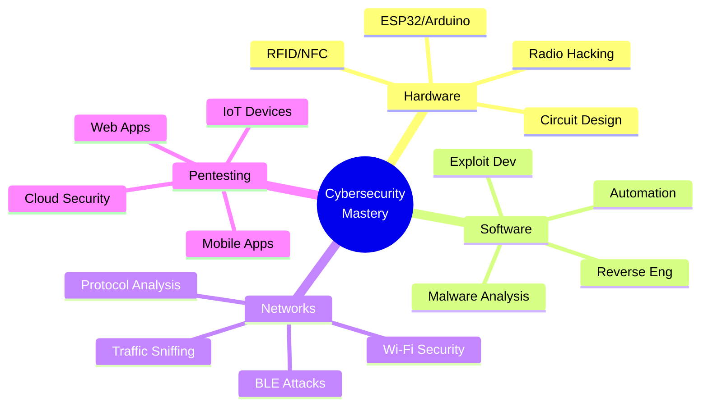
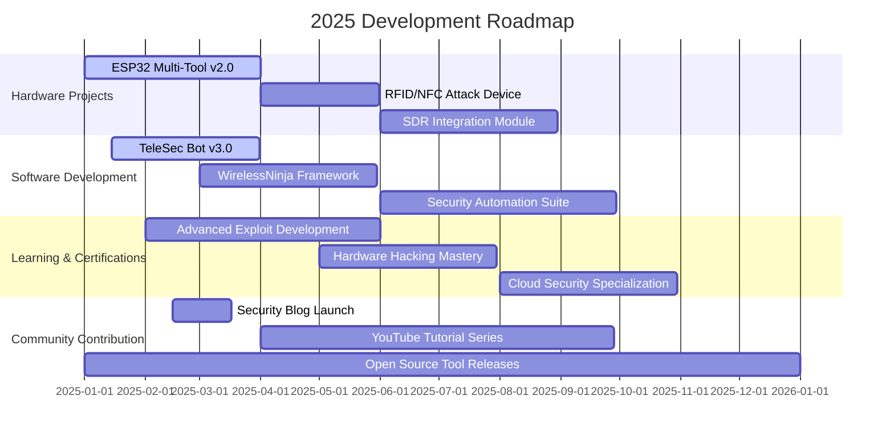

<div align="center">

<!-- Animated Banner -->


<p align="center">
  
</p>

<!-- Social Badges with Counters -->
<p align="center">
  <a href="mailto:muhammadnihalmp955@gmail.com">
    
  </a>
  <a href="https://www.linkedin.com/in/muhammed-nihal-mp-96a346283/">
    
  </a>
  <a href="https://t.me/Muhammed_Nihal_MP">
    
  </a>
</p>

<!-- Animated Profile Views & Stats -->
<p align="center">
  
  
  
</p>


</div>

##  About Me

```javascript
const MuhammedNihal = {
    identity: {
        name: "Muhammed Nihal MP",
        role: "Computer Engineer & Security Researcher",
        location: "Kerala, India 🇮🇳",
        education: "Diploma in Computer Engineering",
        institution: "Ma'din College of Engineering"
    },
    
    expertise: [
        "Penetration Testing & Vulnerability Assessment",
        "Hardware Hacking & Reverse Engineering", 
        "IoT Security & Wireless Exploitation",
        "Custom Hacking Device Development",
        "Automation & Bot Development"
    ],
    
    currentMission: {
        primary: "Building Next-Gen Pentesting Hardware",
        secondary: "Contributing to Cybersecurity Education",
        ultimate: "Making the Digital World Safer"
    },
    
    arsenal: {
        languages: ["Python", "C++", "C", "Java", "Bash", "Go", "Rust", "JavaScript"],
        hardware: ["ESP32", "Arduino", "Raspberry Pi", "Radio Modules"],
        platforms: ["Kali Linux", "Parrot OS", "Ubuntu", "Windows"],
        specialization: "Hardware + Software = Ultimate Security Solutions"
    },
    
    philosophy: () => {
        return "Ethical hacking isn't about breaking systems—it's about " +
               "understanding them at the deepest level to build unbreakable solutions.";
    }
};

console.log(MuhammedNihal.philosophy());
```


##  Current Arsenal

<table align="center">
<tr>
<td width="50%" valign="top">

### 🚀 Active Projects

#### 🔧 **ESP32 Multi-Tool Hacker**
> Advanced wireless pentesting device combining Wi-Fi deauth, packet sniffing, Bluetooth exploitation, and RFID/NFC attacks in one portable unit.

**Stack:** `ESP32` `C++` `Wi-Fi` `BLE` `RFID`  
**Status:** 🟢 Active Development

---

#### 🤖 **TelePwn Bot Suite**
> Intelligent Telegram bot ecosystem for remote IoT control, security automation, and real-time penetration testing coordination.

**Stack:** `Python` `Telegram API` `AsyncIO`  
**Status:** 🟢 Active Development

---

#### 🌐 **WirelessNinja**
> Comprehensive Wi-Fi and Bluetooth exploitation toolkit with automated attack chains and network reconnaissance.

**Stack:** `Python` `Scapy` `BLE Tools`  
**Status:** 🟡 Beta Phase

</td>
<td width="50%" valign="top">

### 🎯 Learning Path



### 📚 Current Studies
- 🔐 Advanced Binary Exploitation
- 📡 Software Defined Radio (SDR)
- 🤖 AI-Powered Security Testing
- 🌐 Cloud Security & DevSecOps
- 🔓 Lock Picking & Physical Security

</td>
</tr>
</table>


##  Tech Stack & Skills

<details open>
<summary><b>🖥️ Programming Languages</b></summary>
<br>

<div align="center">

| Language | Proficiency | Use Case |
|:--------:|:-----------:|:---------|
|  | ⭐⭐⭐⭐⭐ | Automation, Pentesting Scripts, Bot Development |
|  | ⭐⭐⭐⭐⭐ | ESP32/Arduino, Hardware Programming |
|  | ⭐⭐⭐⭐ | Low-Level Programming, Exploit Development |
|  | ⭐⭐⭐⭐⭐ | System Automation, Shell Scripting |
|  | ⭐⭐⭐⭐ | Web Exploitation, Full Stack Development |
|  | ⭐⭐⭐ | Network Tools, Concurrent Programming |
|  | ⭐⭐⭐ | System Programming, Security Tools |
|  | ⭐⭐⭐ | Android Pentesting, Application Security |

</div>

</details>

<details open>
<summary><b>🔐 Cybersecurity Arsenal</b></summary>
<br>

<div align="center">

### Network Reconnaissance & Scanning


### Web Application Security


### Password Cracking & Hash Analysis


### Wireless Security & Exploitation


### Reverse Engineering & Forensics


### OSINT & Information Gathering


### Exploitation & Post-Exploitation


</div>

</details>

<details open>
<summary><b>🔧 Hardware & IoT</b></summary>
<br>

<div align="center">


</div>

</details>

<details open>
<summary><b>💻 Operating Systems & Environments</b></summary>
<br>

<div align="center">


</div>

</details>


##  GitHub Statistics

<div align="center">
  
  
</div>

<div align="center">
  
  
</div>

<br>

<div align="center">
  
</div>

<br>

<!-- Trophy Section -->
<div align="center">
  
</div>


##  Contribution & Activity

<div align="center">

### 🔥 Contribution Snake
<picture>
  <source media="(prefers-color-scheme: dark)" srcset="https://raw.githubusercontent.com/Muhammednihalmp/Muhammednihalmp/output/github-contribution-grid-snake-dark.svg">
  <source media="(prefers-color-scheme: light)" srcset="https://raw.githubusercontent.com/Muhammednihalmp/Muhammednihalmp/output/github-contribution-grid-snake.svg">
  
</picture>

</div>


##  Achievements & Certifications

<div align="center">

| 🎯 Achievement | 📅 Status | 🏆 Level |
|:--------------|:---------:|:--------:|
| **ESP32 Security Toolkit** | ✅ Completed | Advanced |
| **Telegram Bot Framework** | 🔄 In Progress | Intermediate |
| **Wi-Fi Exploitation Suite** | 🔄 In Progress | Advanced |
| **Hardware Pentesting Device** | 📋 Planned | Expert |
| **IoT Security Framework** | 📋 Planned | Expert |
| **Security Blog & Tutorials** | 🔄 Ongoing | Community |

</div>


##  Featured Projects

<div align="center">

<table>
<tr>
<td width="50%">
<h3 align="center">🛡️ ESP32 Hacker Pro</h3>
<div align="center">  
<a href="https://github.com/Muhammednihalmp" target="_blank">

</a>
<br><br>
<p><strong>Multi-protocol wireless hacking device</strong></p>
<p>


</p>
</div>
</td>

<td width="50%">
<h3 align="center">🤖 TeleSec Bot</h3>
<div align="center">
<a href="https://github.com/Muhammednihalmp" target="_blank">

</a>
<br><br>
<p><strong>Telegram security automation framework</strong></p>
<p>


</p>
</div>
</td>
</tr>

<tr>
<td width="50%">
<h3 align="center">📡 WirelessNinja</h3>
<div align="center">
<a href="https://github.com/Muhammednihalmp" target="_blank">

</a>
<br><br>
<p><strong>Advanced wireless penetration toolkit</strong></p>
<p>


</p>
</div>
</td>

<td width="50%">
<h3 align="center">🔐 SecTools Collection</h3>
<div align="center">
<a href="https://github.com/Muhammednihalmp" target="_blank">

</a>
<br><br>
<p><strong>Custom security scripts & utilities</strong></p>
<p>


</p>
</div>
</td>
</tr>
</table>

</div>


##  Philosophy & Vision

<div align="center">

### 🛡️ Core Principles

```ascii
╔══════════════════════════════════════════════════════════════╗
║                                                              ║
║  "True hacking isn't about destruction—it's about           ║
║   understanding systems at their deepest level,             ║
║   finding vulnerabilities before malicious actors,          ║
║   and building a more secure digital future for all."       ║
║                                                              ║
║  Security through knowledge. Innovation through passion.    ║
║  Excellence through dedication. Impact through ethics.      ║
║                                                              ║
╚══════════════════════════════════════════════════════════════╝
```

### 🎯 Mission Statement

<table>
<tr>
<td align="center" width="25%">

<br><strong>LEARN</strong>
<br><sub>Continuously master new security domains</sub>
</td>
<td align="center" width="25%">

<br><strong>BUILD</strong>
<br><sub>Create innovative security tools & hardware</sub>
</td>
<td align="center" width="25%">

<br><strong>SHARE</strong>
<br><sub>Educate the community responsibly</sub>
</td>
<td align="center" width="25%">

<br><strong>SECURE</strong>
<br><sub>Make the digital world safer</sub>
</td>
</tr>
</table>

</div>


##  Let's Collaborate

<div align="center">

### 🤝 Open to Working On

<table>
<tr>
<td align="center" width="33%">

<br><strong>Research Projects</strong>
<br><sub>Cybersecurity research<br>Vulnerability discovery<br>Exploit development</sub>
</td>
<td align="center" width="33%">

<br><strong>Hardware Innovation</strong>
<br><sub>Custom pentesting devices<br>IoT security solutions<br>Wireless attack tools</sub>
</td>
<td align="center" width="33%">

<br><strong>Open Source</strong>
<br><sub>Security tool development<br>Community contributions<br>Educational content</sub>
</td>
</tr>
</table>

### 📬 Get In Touch

<p align="center">
  <a href="mailto:muhammadnihalmp955@gmail.com">
    
  </a>
  <a href="https://www.linkedin.com/in/muhammed-nihal-mp-96a346283/">
    
  </a>
  <a href="https://t.me/Muhammed_Nihal_MP">
    
  </a>
</p>

<p align="center">
  
  
  
</p>

</div>


##  Activity Metrics

<div align="center">

### 📈 Coding Activity

<!--START_SECTION:waka-->
```text
Python       12 hrs 45 mins  ████████████░░░░░░░░░   48.2%
C++           8 hrs 30 mins  ████████░░░░░░░░░░░░░   32.1%
Bash          3 hrs 15 mins  ███░░░░░░░░░░░░░░░░░░   12.3%
JavaScript    1 hr 45 mins   █░░░░░░░░░░░░░░░░░░░░    6.6%
Other         15 mins        ░░░░░░░░░░░░░░░░░░░░░    0.8%
```
<!--END_SECTION:waka-->

### 🌟 Repository Insights


</div>


##  Knowledge Base & Blog

<div align="center">

### 📚 Recent Articles & Tutorials

| 📝 Title | 🏷️ Category | 📅 Date |
|:---------|:----------:|:-------:|
| Building an ESP32 Wi-Fi Deauther | Hardware Hacking | Coming Soon |
| Telegram Bot Security Best Practices | Automation | Coming Soon |
| Bluetooth Low Energy Exploitation | Wireless Security | Coming Soon |
| IoT Device Penetration Testing Guide | IoT Security | Coming Soon |

<p>
  
  
  
</p>

</div>


##  Roadmap 2025

<div align="center">



</div>


##  Support & Recognition

<div align="center">

### ⭐ If you find my work valuable

<table>
<tr>
<td align="center" width="33%">

<br><br>
<strong>Star My Repos</strong>
<br><sub>Show your appreciation by starring my projects</sub>
</td>
<td align="center" width="33%">

<br><br>
<strong>Follow Me</strong>
<br><sub>Stay updated with my latest security research</sub>
</td>
<td align="center" width="33%">

<br><br>
<strong>Collaborate</strong>
<br><sub>Let's build something amazing together</sub>
</td>
</tr>
</table>

<p>
  <a href="https://github.com/Muhammednihalmp?tab=followers">
    
  </a>
  <a href="https://github.com/Muhammednihalmp?tab=repositories">
    
  </a>
</p>

### 💖 Sponsors & Contributors

<p>
  <a href="https://github.com/Muhammednihalmp/Muhammednihalmp/graphs/contributors">
    
  </a>
</p>

</div>


##  Legal & Disclaimer

<div align="center">

```diff
@@ ETHICAL HACKING DISCLAIMER @@

+ All tools and projects are for EDUCATIONAL and AUTHORIZED TESTING purposes only
+ I DO NOT condone or support any form of unauthorized hacking or illegal activities
+ Always obtain proper authorization before testing systems you don't own
+ Users are responsible for complying with all applicable laws and regulations
+ Misuse of these tools may result in criminal charges

! USE AT YOUR OWN RISK - I am not responsible for any misuse or damage
```

<p>
  
  
  
</p>

</div>


##  Random Dev Quote

<div align="center">


</div>


##  Fun Facts

<div align="center">

<table>
<tr>
<td>

### 🎯 Quick Facts About Me

- 🕐 I code best during: **Late Night 🌙**
- ☕ Coffee consumed daily: **4-6 cups**
- 🎵 Coding soundtrack: **Cyberpunk & Lo-fi**
- 🎮 Favorite CTF platform: **HackTheBox**
- 🔧 First programming language: **Python 🐍**
- 💻 Favorite terminal: **Zsh with Oh-My-Zsh**
- 🌐 Dream project: **All-in-One Pentesting Suite**
- 📚 Currently reading: **Hardware Hacking Handbook**

</td>
<td>

### 💭 Random Dev Joke


### 🎲 Did You Know?

*The first computer bug was an actual bug (a moth) found in a Harvard Mark II computer in 1947!*

</td>
</tr>
</table>

</div>


<div align="center">

## 🙏 Thank You for Visiting!


### 💙 Made with passion, powered by curiosity, driven by security

<p>
  
</p>

[](https://www.buymeacoffee.com/muhammednihal)

<sub>⭐ From [Muhammednihalmp](https://github.com/Muhammednihalmp) | Last Updated: 2025 | Built with ❤️ and ☕</sub>

</div>
